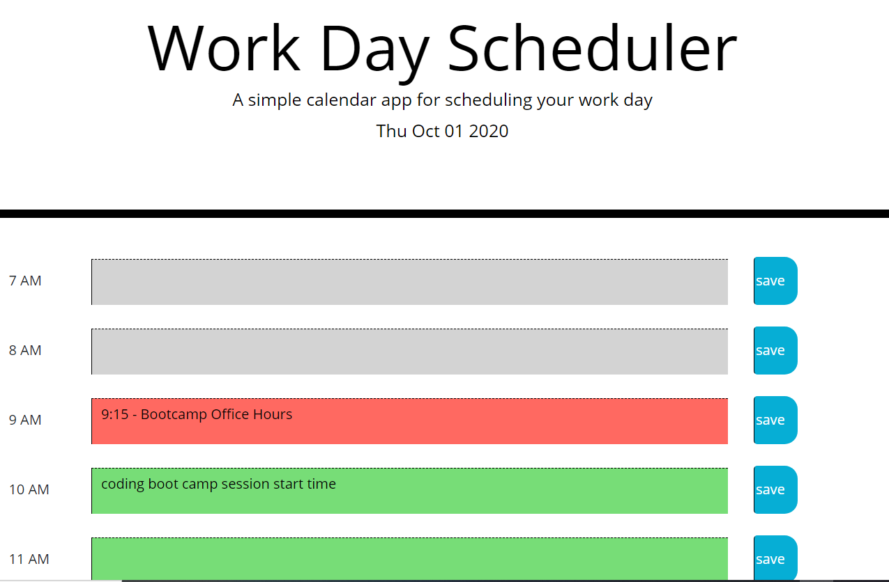

# Day_Scheduler
```
Day Scheduler allows users to save events for each hour of th day.

```

## Description

```
People with busy schedule can use this application to add important events to the daily planner, so that they can manage their time effectively

```

## Working of the Application
```
When the user runs this application in the browser, 

1) The current date will be displayed as part of the header
2) The timeblocks they will be able to view and update is from 7AM to 8PM. With a very minor change in the application, it is possible to change the hourly timeblock to different range
3) Each timeblock also will be color coded to indicate whether this is in the past, present, or future
4) When the timeblock is clicked, then can enter an event
5) Unless the SAVE button is explicitly clicked, the entered event will not be saved
6) Once the event is saved, the information will persist whenever they run the application
7) If the user wants to delete that entry, they have to go back to that timeblock and delete the information and resave it.

```

## Screenshot of the application  - notice the color coding of the timeblock
```
Past hour timeblocks are coded - Gray
Present hour timeblock is coded - Orange
Future hour timeblock is coded - Green
```


## URL of the application

* The URL of the deployed application - https://meenaambalam.github.io/Day_Scheduler/

* The URL of the GitHub repository - https://github.com/meenaambalam/Day_Scheduler

